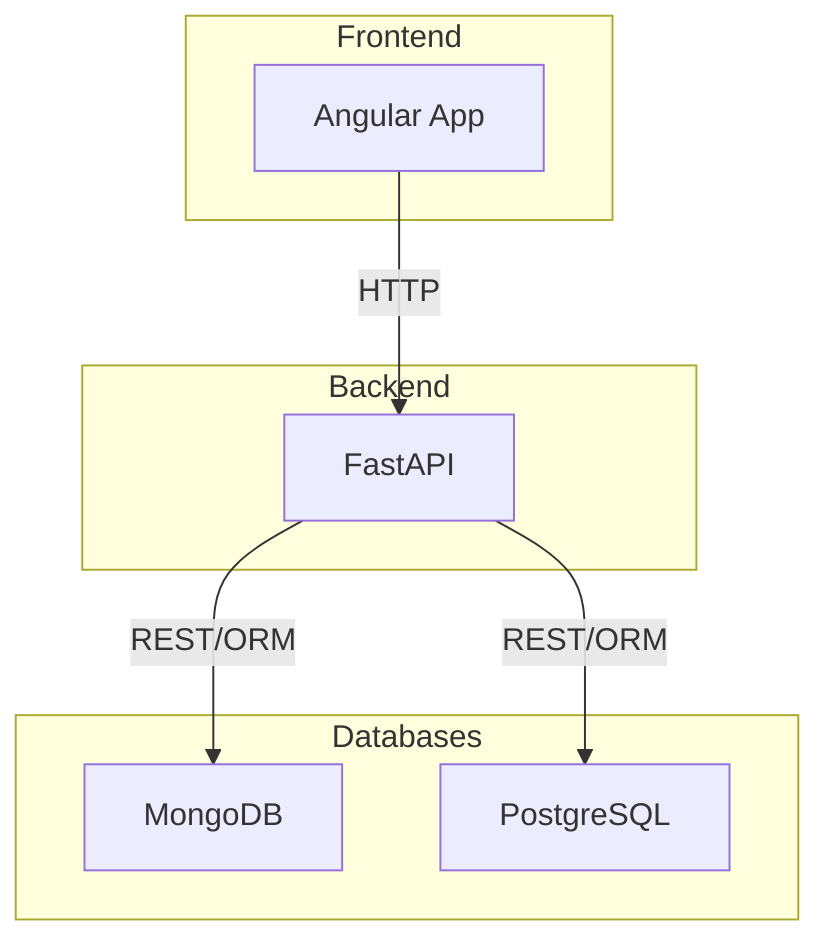

# systemauto
Sistema desenvolvido para empresas do setor automotivo, como concessionárias, revendedoras e locadoras.

# Infraestrutura


# Como rodar localmente

1. **Pré-requisitos:**
   - Docker e Docker Compose instalados
   - (Opcional) Arquivo `.env` com variáveis de ambiente necessárias na raiz do projeto

2. **Suba os serviços:**
   No diretório raiz do projeto, execute:
   ```bash
   docker-compose up --build
   ```
   Isso irá construir e iniciar todos os containers (frontend, backend, MongoDB, PostgreSQL).

3. **Acesse os serviços:**
   - Frontend Angular: http://localhost:4200
   - Backend FastAPI: http://localhost:8000 (docs: http://localhost:8000/docs)
   - MongoDB: localhost:27017
   - PostgreSQL: localhost:55432

4. **Hot reload:**
   - Qualquer alteração feita nos arquivos do frontend ou backend será refletida automaticamente, sem necessidade de reiniciar os containers.

5. **Parar os serviços:**
   ```bash
   docker-compose down
   ```

Se encontrar problemas, verifique os logs dos containers com:
```bash
# Exemplo para o frontend
docker logs erp-angular-frontend
```