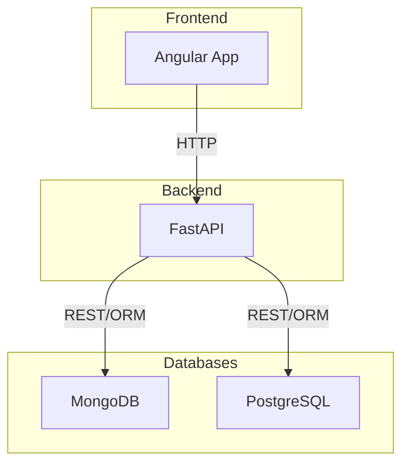

# systemauto
Sistema desenvolvido para empresas do setor automotivo, como concessionárias, revendedoras e locadoras.

# Infraestrutura

```mermaid
graph TD
    subgraph Frontend
        A[Angular App]
    end

    subgraph Backend
        B[FastAPI]
    end

    subgraph Databases
        C[MongoDB]
        D[PostgreSQL]
    end

    A -->|HTTP| B
    B -->|REST/ORM| C
    B -->|REST/ORM| D
```